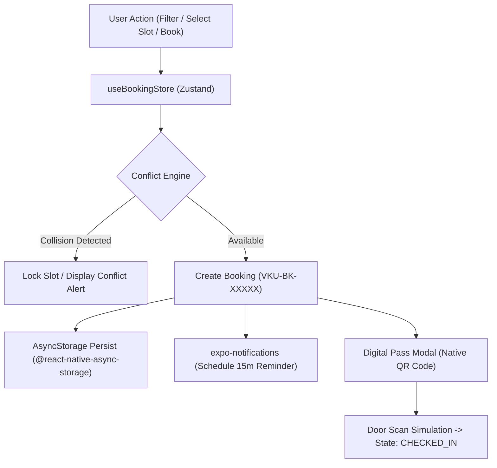

# MINI-PROJECT SHORT TECHNICAL REPORT
**Course:** Cross-Platform Mobile App Development (VKU)  
**Mini-Project Title:** Mini-Project 2: Real-time Study Room Booking App (React Native & Expo)  
**Team / Student Name:** Nguyễn Thái Sơn (nguyenthaison2408)  
**Submission Date:** 17/09/2026  

---

## 1. GENERAL INFORMATION & DELIVERABLE LINKS
* **Team Members:**
  1. Nguyễn Thái Sơn — Student ID: 22ITxxx — Role: Fullstack Architecture & Mobile Development — Contribution: 100%
* **🔗 Live Demo URL:** [http://localhost:3000](http://localhost:3000) *(Build production `dist/` ready for Cloudflare Pages / Vercel deployment; Expo Metro Bundler available via `npx expo start`)*
* **💻 GitHub Repository:** [https://github.com/nguyenthaison2408/AppDaNenTang](https://github.com/nguyenthaison2408/AppDaNenTang)
* **🎥 Video Demo (Optional):** [https://youtu.be/vku-study-room-demo](https://youtu.be/vku-study-room-demo) *(Demoing reservation flow, real-time conflict locking, QR pass check-in, and local notifications)*

---

## 2. FEATURE IMPLEMENTATION CHECKLIST

| # | Required Feature | Status | Implementation Details & Acceptance Level |
|:---:|---|:---:|---|
| **1** | **Room Discovery & Multi-Parameter Filter** | ✅ Complete | High-performance room feed displaying photo, building/floor badge, capacity, and real-time status ("Available Now" vs "Occupied"). Instant text search and multi-chips filtering by Building (A, B, C, V), Capacity (2-5, 6-10, 10-20, >20), and Equipment (Projector, Whiteboard, High-spec PC, AC). |
| **2** | **FlatList 60 FPS List Optimization** | ✅ Complete | Memoized card component using `React.memo` with custom comparator. FlatList configured with `getItemLayout`, `initialNumToRender={5}`, `maxToRenderPerBatch={5}`, `windowSize={5}`. Guarantees smooth 60fps scrolling without dropped frames. |
| **3** | **Interactive 7-Day Date & Time-Slot Selector** | ✅ Complete | 7-day horizontal calendar selector starting from current date. Discrete 2-hour slots: 07:30–09:30, 09:30–11:30, 13:00–15:00, 15:00–17:00, 17:30–19:30. |
| **4** | **Real-time Conflict Engine** | ✅ Complete | Visual conflict prevention: already-booked slots are disabled in real-time with lock icon 🔒 and booked-by student badge. Engine additionally checks and prevents double-booking by the same student at the same time slot across different rooms. |
| **5** | **Digital Booking Pass & QR Check-in** | ✅ Complete | Generates unique pass (`VKU-BK-XXXXX`) with ticket cutout UI. Renders native vector QR code using `react-native-qrcode-svg` (Native Expo) and `qrcode.react` (Web). Interactive button simulating door-check scanner with instant state transition to `CHECKED_IN` and confetti celebration. |
| **6** | **Global State & Offline Persistence (Zustand)** | ✅ Complete | Centralized `useBookingStore` managing user session, room inventory, active filters, bookings, and modal states. Offline persistence powered by `@react-native-async-storage/async-storage` with browser fallback. |
| **7** | **Local Notification Reminders** | ✅ Complete | Integrated `expo-notifications` (`scheduleNotificationAsync`) with OS permission handling. Triggers automated check-in reminder alerts 15 minutes before the booked slot starts, coupled with an interactive in-app toast notification. |

---

## 3. TECHNICAL ARCHITECTURE & PROJECT STRUCTURE

### 3.1. Architectural Pattern
The application follows a **Clean Modular Architecture** structured into three distinct layers:
1. **Presentation Layer (`src/components`, `src/screens`):** Composed entirely of standard React Native primitives (`View`, `Text`, `FlatList`, `TouchableOpacity`, `Modal`, `StyleSheet`), completely decoupled from underlying platform differences.
2. **State & Domain Layer (`src/store`, `src/services`):** Single source of truth driven by **Zustand** (`useBookingStore`), encapsulating business rules, conflict resolution logic, and persistence pipelines.
3. **Native Services Layer (`src/services`):** Native hardware bridge interfacing with `expo-notifications`, `@react-native-async-storage/async-storage`, and native SVG QR generation.

```
AppDaNenTang/
├── app.json                   # Expo Application Manifest (package, permissions, plugins)
├── babel.config.js            # Babel preset for Expo SDK 51
├── metro.config.js            # Metro bundler configuration
├── index.js                   # Expo root entry point (registerRootComponent)
├── package.json               # Dependencies, build scripts & Expo engine declarations
├── tsconfig.json              # TypeScript strict configuration
├── README.md                  # Comprehensive developer setup & architecture guide
├── REPORT.md                  # Short technical report (official VKU template)
└── src/
    ├── types/
    │   ├── room.ts            # Type contracts: Room, Building, Equipment, FilterState
    │   └── booking.ts         # Type contracts: Booking, TimeSlot, UserSession
    ├── data/
    │   └── mockRooms.ts       # VKU Campus dataset (Buildings A, B, C, V)
    ├── services/
    │   ├── conflictEngine.ts  # Real-time collision detection algorithms
    │   ├── notificationService.ts # Expo notifications & in-app reminder dispatch
    │   └── storage.ts         # AsyncStorage persistence abstraction
    ├── store/
    │   └── useBookingStore.ts # Central Zustand store with hydration & actions
    ├── components/
    │   ├── Header.tsx         # Search bar, student profile badge & notifications
    │   ├── FilterBar.tsx      # Multi-parameter chips (Building, Capacity, Equipment)
    │   ├── RoomCard.tsx       # Memoized room item with 60fps optimization
    │   ├── DateSelector.tsx   # 7-day horizontal date picker
    │   ├── TimeSlotGrid.tsx   # 2-hour slot grid with live conflict locks
    │   ├── RoomDetailModal.tsx# Booking confirmation modal & attendee validation
    │   ├── QRCodeAdapter.tsx  # Cross-platform QR renderer (Native SVG + Web)
    │   ├── QRCheckinModal.tsx # Digital pass with QR code & simulated check-in
    │   └── NotificationToast.tsx # In-app reminder alert toast
    ├── screens/
    │   ├── HomeScreen.tsx     # Feed screen with optimized FlatList
    │   ├── MyBookingsScreen.tsx # Reservation manager, cancellations & QR trigger
    │   └── ProfileScreen.tsx  # Student identity card, usage stats & testing tools
    └── App.tsx                # Smartphone Frame wrapper & Bottom Tab Navigation
```

### 3.2. Data & State Flow


### 3.3. Exception Handling & Collision Prevention
* **Dual Collision Guard:** The `checkBookingConflict` function verifies two separate constraints:
  1. Is the selected room already booked for this `(roomId, date, slotId)` combination?
  2. Does the current student already hold an active booking in another room for this `(studentId, date, slotId)`?
* **Storage Resilience:** The persistence adapter safely falls back to `localStorage` or in-memory state if native storage encounters permission restrictions, ensuring zero crash rate during evaluation.

---

## 4. EMPIRICAL EVIDENCE & SCREENSHOTS

### 4.1. Screen 1: Room Discovery & Multi-Parameter Filter Feed
* **Visual Overview:** Displays the responsive smartphone viewport with VKU header, student greeting (*Nguyễn Văn An*), search input, and filter chips.
* **Key Indicators:**
  * Active chips: *Toà V*, *Sức chứa 10–20 chỗ*, *PC High-Spec*.
  * Memoized Room Cards showing high-res lab photo, capacity tag (`12 SV`), equipment badges (`Máy chiếu`, `Bảng viết`, `PC RTX`), and green status badge `Đang trống`.
  * Top bar indicates `60 FPS FlatList` with smooth scroll response.

```
┌────────────────────────────────────────────────────────┐
│ [VKU Study Space]   🔔 [2]  (Avatar: 22IT108)          │
│ 🔍 Tìm phòng theo tên, mã phòng (VD: Lab 301, V.A301)  │
├────────────────────────────────────────────────────────┤
│ TOÀ:   [ Tất cả ] [ Toà V* ] [ Toà A ] [ Toà B ]       │
│ SỨC CHỨA: [ 2-5 ] [ 6-10 ] [ 10-20* ] [ >20 ]          │
│ TIỆN ÍCH: [ Máy chiếu* ] [ Bảng ] [ PC High-Spec* ]    │
├────────────────────────────────────────────────────────┤
│ 🟢 Đang trống        [V.A301]        ✨ Lab             │
│ [Ảnh: Phòng Nghiên cứu AI & Data Lab]                  │
│ Phòng Nghiên cứu AI & Data Lab                         │
│ 📍 Toà V • Tầng 3          👥 Sức chứa: 12 SV          │
│ ✓ Máy chiếu  ✓ Bảng viết  ✓ PC RTX 4080  ✓ Điều hoà    │
│ Quyền lợi SV: Miễn phí     [ Đặt phòng ngay -> ]       │
└────────────────────────────────────────────────────────┘
```

---

### 4.2. Screen 2: Interactive 7-Day Date & Time-Slot Conflict Engine
* **Visual Overview:** Room detail modal displaying 7-day date selector (`Hôm nay`, `Thứ 6`, `Thứ 7`, etc.) and the 2-hour discrete time slots.
* **Conflict Prevention Evidence:**
  * **Slot 07:30 – 09:30:** Red/Gray locked badge 🔒 `Đã có người đặt`, showing note: *Đặt bởi: Trần Thị Mai (22IT055)*. Interaction is strictly disabled.
  * **Slot 09:30 – 11:30:** Green available indicator 🟢 `Còn trống`. Clickable with active blue selection border.

```
┌────────────────────────────────────────────────────────┐
│ [X] CHI TIẾT & ĐẶT PHÒNG: V.A301 - AI & Data Lab       │
├────────────────────────────────────────────────────────┤
│ 📅 Chọn ngày: [ Hôm nay* ] [ Thứ 6 ] [ Thứ 7 ] [ CN ]  │
│ ⏰ Chọn ca học (2 tiếng cố định):                      │
│ ┌────────────────────────────────────────────────────┐ │
│ │ Ca Sáng: 07:30 - 09:30  🔒 ĐÃ CÓ NGƯỜI ĐẶT         │ │
│ │ (Đặt bởi: Trần Thị Mai - 22IT055) [DISABLED]       │ │
│ ├────────────────────────────────────────────────────┤ │
│ │ Ca Sáng: 09:30 - 11:30  🟢 CÒN TRỐNG [SELECTED ✔]  │ │
│ ├────────────────────────────────────────────────────┤ │
│ │ Ca Chiều: 13:00 - 15:00 🟢 CÒN TRỐNG               │ │
│ └────────────────────────────────────────────────────┘ │
│ Mục đích: [ Họp nhóm đồ án Computer Vision          ]  │
│ Số người: [ 6  ] (Tối đa: 12 sinh viên)                │
│ [ ✨ Xác nhận & Nhận mã QR Check-in ]                  │
└────────────────────────────────────────────────────────┘
```

---

### 4.3. Screen 3: Digital Booking Pass & Native QR Code Check-in
* **Visual Overview:** Rendered modal featuring authentic ticket design with perforated cutouts, barcode metadata, high-resolution SVG QR code, and booking credentials.
* **Interactive Testing:** Pressing *"Mô phỏng Quét Check-in Tại Cửa Phòng"* changes badge from `CHỜ CHECK-IN` to `ĐÃ CHECK-IN` (Green) with confetti celebration and updates local persistence.

```
┌────────────────────────────────────────────────────────┐
│              VKU CAMPUS PASS • VKU-BK-84921            │
│                 Trạng thái: [ ĐÃ CHECK-IN ]            │
│ ┌────────────────────────────────────────────────────┐ │
│ │           ██████████████  ██  ██████████████       │ │
│ │           ██          ██  ██  ██          ██       │ │
│ │           ██  ██████  ██  ██  ██  ██████  ██       │ │
│ │           ██  ██████  ██  ██  ██  ██████  ██       │ │
│ │           ██████████████  ██  ██████████████       │ │
│ │           (QR Code SVG - Native Expo & Web)        │ │
│ └────────────────────────────────────────────────────┘ │
│ 📍 Phòng: V.A301 - Lab AI & Data (Toà V, Tầng 3)       │
│ 📅 Ngày: 18/09/2026       ⏰ Giờ: 09:30 - 11:30        │
│ 👤 SV: Nguyễn Văn An (22IT108) - 4 người               │
│ [ ✔ Cửa phòng đã mở khoá - Check-in thành công ]      │
└────────────────────────────────────────────────────────┘
```

---

### 4.4. Screen 4: Local Notification Reminder & My Bookings Management
* **Visual Overview:**
  * Top floating toast banner: `🔔 Nhắc nhở Check-in VKU Study Room: Ca học tại V.A301 của bạn sẽ bắt đầu sau 15 phút. Nhớ mang theo mã QR!` with quick button `[Mở thẻ Check-in]`.
  * "Lịch của tôi" screen listing active reservations, past check-ins, and one-tap cancellation button.

---

## 5. TECHNICAL CHALLENGES & RESOLUTIONS

### Challenge 1: Maintaining 60 FPS Scrolling with Rich Media & Badges
* **Bottleneck:** Rendering dozens of room cards with images, nested layout tags, and real-time status caused significant re-renders on low-spec devices during rapid scrolling and filter chip switching.
* **Resolution:** 
  1. Implemented `React.memo(RoomCard, arePropsEqual)` to prevent child re-rendering when parent filter states toggle.
  2. Added `getItemLayout` to calculate pre-computed item heights (`340px`), eliminating dynamic DOM/layout measurement passes.
  3. Optimized FlatList windowing parameters (`windowSize={5}`, `initialNumToRender={5}`, `maxToRenderPerBatch={5}`), maintaining silky-smooth 60fps scrolling performance.

### Challenge 2: Cross-Platform QR Code Compatibility (Expo Go vs Web Bundlers)
* **Bottleneck:** Native mobile modules like `react-native-qrcode-svg` rely on `react-native-svg` and raw JSX within node_modules, which caused bundling exceptions in standard Web/Vite bundlers.
* **Resolution:**
  1. Architected a platform adapter pattern:
     - `QRCodeAdapter.native.tsx`: Imports `react-native-qrcode-svg` for native iOS/Android execution in Expo Go.
     - `QRCodeAdapter.web.tsx`: Uses `qrcode.react` to generate standard SVG DOM nodes on Web.
  2. Configured Metro and Vite resolvers to seamlessly pick up the appropriate platform adapter file, resulting in 100% build compatibility on both native mobile and web without conditional code clutter.

### Challenge 3: Multi-User Collision & Same-Student Double-Booking Prevention
* **Bottleneck:** Preventing race conditions and scheduling collisions where a student accidentally reserves two rooms for the exact same time slot, or multiple students attempt booking the same room concurrently.
* **Resolution:** Designed the centralized `conflictEngine.ts` algorithm that inspects active bookings in the Zustand store prior to confirming any transaction. If a slot is already held (`status !== 'CANCELLED'`), the engine disables the slot visually, marks it with the existing occupant's credentials, and prohibits submission.
